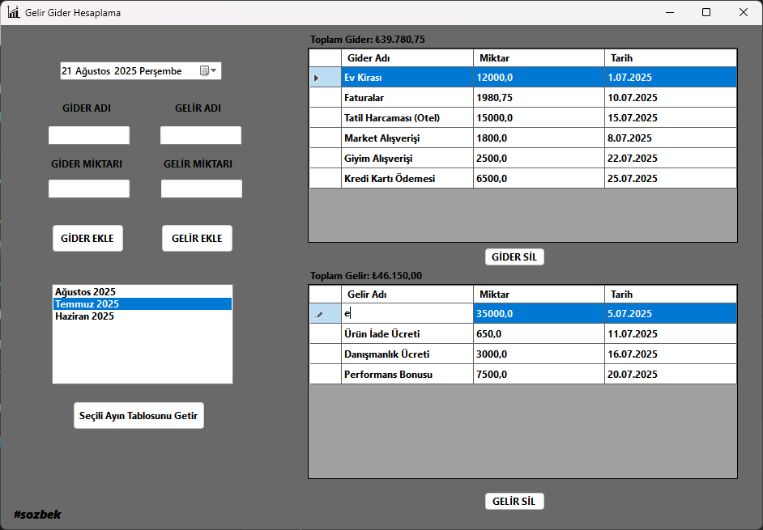

## Gider Takip Programı v.1.1 | Akdeniz Üniversitesi Ybs Bitirme Projesi 1

**.NET 8 ve C# ile geliştirilmiş, modern ve kullanıcı dostu bir kişisel gelir-gider takip masaüstü uygulaması.**

  

---

**Hızlı Başlangıç & Kurulum**

Bu uygulamayı bir geliştirici değilseniz ve sadece kullanmak istiyorsanız, en kolay yol aşağıdadır. Kaynak kodlarıyla uğraşmanıza gerek yoktur.

**Kurulum Dosyasını İndirin:**

Projenin en güncel ve stabil sürümünü indirmek için aşağıdaki linke tıklayın. Bu link sizi doğrudan kurulum dosyasının olduğu Releases (Sürümler) sayfasına götürecektir.

👉 En Son Sürümü İndirmek İçin Tıklayın ([GitHub Releases](https://github.com/serhatozbek/Gider_Takip.exe/releases/tag/GiderTakipProgrami))

Programı Kurun:

- Assets bölümünden Gider_Takip_Setup.exe dosyasını indirin.

- İndirdiğiniz .exe dosyasını çalıştırarak kurulum adımlarını takip edin.

- Kurulum tamamlandığında, masaüstünüzde ve Başlat Menünüzde oluşan kısayol ile programı çalıştırabilirsiniz.

---

#### Projenin Amacı ve Özellikleri

Bu uygulama, kullanıcıların kişisel bütçelerini kolay ve etkili bir şekilde yönetmelerini sağlamak amacıyla geliştirilmiştir. Programın en belirgin özelliği, verileri aylık periyotlar halinde yönetmesidir.

- 📅 Aylık Veri Dosyaları: Program, her aya ait gelir ve gider verilerini ayrı ayrı .json dosyalarında saklar. Bu yapı, verilerin düzenli ve yönetilebilir olmasını sağlar.

- 📂 Geçmiş Kayıtlara Erişim: Arayüzdeki "Mevcut Aylar" listesi sayesinde, daha önceki aylara ait tüm kayıtlara kolayca ulaşabilir ve görüntüleyebilirsiniz.

- ✏️ Kayıt Yönetimi: Aktif olarak görüntülenen aya kolayca yeni gelir/gider ekleyebilir veya mevcut kayıtları silebilirsiniz.

- 🧮 Otomatik Toplam Hesaplama: Görüntülenen aydaki toplam gelir ve giderleriniz anlık olarak hesaplanır ve size sunulur.

---

#### Teknik Yapı ve Gereksinimler

Bu bölüm, projeyi kaynak kodundan çalıştırmak veya geliştirmek isteyenler için teknik detayları içermektedir.

- Platform: .NET 8 Desktop

- Dil: C#

- Arayüz: Windows Forms (WinForms)

- Veri Saklama: JSON dosyaları (Newtonsoft.Json kütüphanesi kullanılarak)

- Kurulum Paketi: Inno Setup

**Kullanıcı Gereksinimleri**

- Programı çalıştırmak için: .NET 8 Desktop Runtime

**Geliştirici Gereksinimleri**

- Kodu derlemek için: .NET 8 SDK

- Tavsiye edilen geliştirme ortamı: Visual Studio 2022

---

#### Kaynak Kodundan Geliştirme

Projeye katkıda bulunmak veya kendi bilgisayarınızda derlemek isterseniz:

- Bu depoyu git clone komutuyla veya ZIP olarak indirin.

- .sln uzantılı proje dosyasını Visual Studio 2022'de açın.

- Projeyi derlemek için Build > Build Solution adımlarını izleyin.

---

**Katkıda Bulunma**

Bu proje açık kaynaklıdır ve katkılarınızı memnuniyetle karşılarız. Hata bildirimleri, özellik istekleri veya kod katkıları için lütfen bu deponun "Issues" ve "Pull Requests" sekmelerini kullanın.

---
